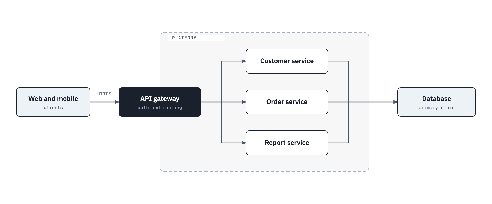

---
# A business proposal. Fill these in, then build:
#   python3 build_docx.py templates/proposal.md --pdf
# The company name and address come from the theme's defaults; set
# COMPANY_NAME, COMPANY_TEAM, COMPANY_ADDRESS_1 and COMPANY_ADDRESS_2 here to override them.
PROJECT_NAME: "Example Project"
CLIENT_LEGAL_NAME: "Example Client Co., Ltd."
CLIENT_SHORT_NAME: "Example Client"
VERSION: "0.1"
DD MMM YYYY: "1 Oct 2026"
Draft / For Review / Final: "Draft"
# Timeline: set these six dates and the chart in Section 7 draws itself
PROJECT_START: 2026-10
BUILD_START: 2026-12
TEST_START: 2027-03
DEPLOY_START: 2027-04-15
KICKOFF_DATE: 2026-10-06
GOLIVE_DATE: 2027-05-29
---

# TABLE OF CONTENTS

<!-- toc -->

# 1. EXECUTIVE SUMMARY

{{COMPANY_NAME}} is pleased to propose **{{PROJECT_NAME}}** for {{CLIENT_LEGAL_NAME}}.

Say in two or three sentences what the client wants to achieve, what this proposal delivers, and why it is the right fit. Write it for this client; a summary that could be sent to anyone persuades no one.

# 2. ABOUT US

Who we are, what we have built that is close to this project, and the one or two facts that make us credible for it.

# 3. PROJECT OVERVIEW

## Objectives

1. The first outcome the client needs.
2. The second outcome.
3. The measure that will show the project succeeded.

## Current situation

What exists today, what is not working, and what constrains the solution.

# 4. SCOPE OF WORK

## Scope of function

| No. | Module | Feature | Description | In scope |
| --: | :-- | :-- | :-- | :-: |
| **Customer channel** |  |  |  |  |
| 1 | Onboarding | Account opening | Customer registers and verifies identity | Yes |
| 2 | Onboarding | Profile | Customer views and updates personal details | Yes |
| **Back office** |  |  |  |  |
| 3 | Operations | Approval queue | Staff review and approve pending requests | Yes |
| 4 | Reports | Daily summary | Daily activity report for management | No |

*Anything not listed in this table is out of scope and will be handled as a change request.*

## Out of scope

- Data migration from the existing system
- Changes to third-party systems

# 5. SOLUTION

## Technology stack

| Layer | Technology |
| :-- | :-- |
| Web and mobile | Your front-end stack |
| Services | Your back-end stack |
| Data | Your database |
| Hosting | Your cloud or on-premises platform |

## Architecture



# 6. TEAM

| Role | Persons | Responsibility |
| :-- | --: | :-- |
| Project manager | 1 | Plan, track and report on the project; manage scope and risks |
| Tech lead | 1 | Own the architecture and technical decisions |
| Developer | 3 | Build and unit-test the features in scope |
| QA | 1 | Plan and run functional and regression testing |

<!-- landscape -->

# 7. PROJECT TIMELINE

```markwhen
title: Indicative project plan

group Design
{{PROJECT_START}}/2 months: Requirements, UX/UI and system design #design
{{PROJECT_START}}/1 month: Environment setup for SIT and UAT #infra
endGroup

group Build
{{BUILD_START}}/3 months: Implementation #build
endGroup

group Test
{{TEST_START}}/1 month: System integration testing #test
{{TEST_START}}/6 weeks: UAT and regression #test
endGroup

group Deploy
{{DEPLOY_START}}/6 weeks: Training, production setup and go-live #deploy
endGroup

{{KICKOFF_DATE}}: Kick-off
{{GOLIVE_DATE}}: Go-live
```

1. Implementation starts after the requirements are signed off.
2. Each sprint is 2 weeks.
3. The plan excludes changes of scope and work that depends on third parties.

<!-- portrait -->

# 8. ASSUMPTIONS

| Factor | Detail |
| :-- | :-- |
| Assumptions | APIs and their documentation are accurate and available when the build starts. |
| Dependencies | Third-party systems provide test environments on time. |
| Constraints | The go-live date depends on the client's release calendar. |

# 9. PRICE AND PAYMENT

| Item | Price (excluding VAT) |
| :-- | --: |
| Design and build | 1,200,000.00 |
| Testing and go-live support | 300,000.00 |
| **Total** | **1,500,000.00** |

| Milestone | Share | Amount (excluding VAT) |
| :-- | --: | --: |
| Contract signed | 30% | 450,000.00 |
| UAT sign-off | 50% | 750,000.00 |
| Go-live | 20% | 300,000.00 |

# 10. TERMS AND CONDITIONS

1. This proposal is valid for 60 days from the date on the cover.
2. Work outside the scope in Section 4 is handled as a change request, estimated and approved before it starts.
3. Prices exclude VAT.
