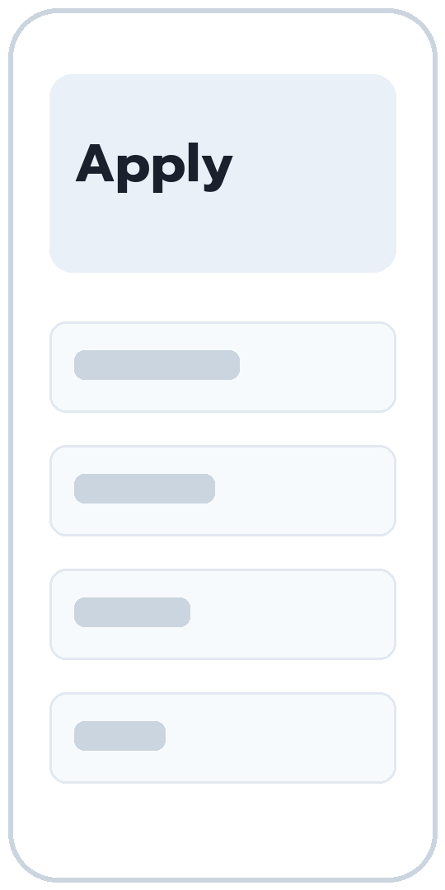
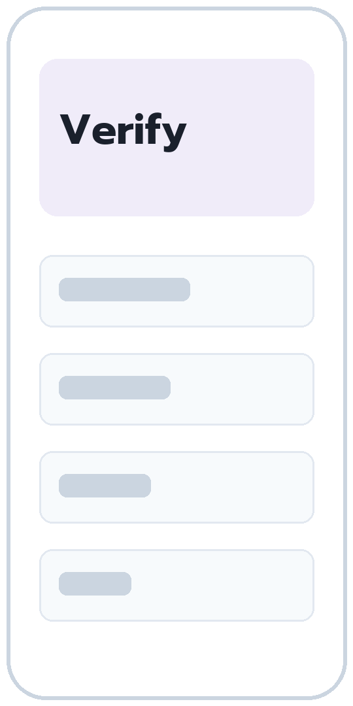
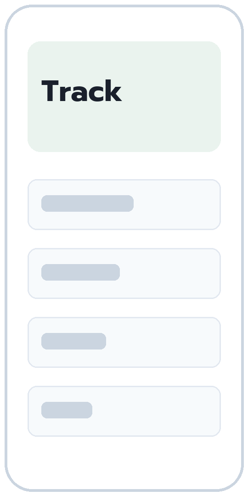

---
# Every slide layout Imprint builds, and the Markdown that makes each one. Build it with:
#   imprint pptx showcase.md --pdf
TITLE: "Slide layouts"
SUBTITLE: "Every layout Imprint builds, and the Markdown behind it"
DATE: "2026-10-01"
---

<!-- toc -->

# Layouts for ideas

A statement, numbers, cards and a comparison.

## Onboarding is the slowest step we can fix this year

> Customers wait five working days to open an account, and most of that wait is re-keying.

Operations review, September 2026

<!-- notes: A slide with only a > quote and a source line becomes a statement. -->

## The pilot changed four numbers

- **5 to 1** working days to open an account
- **38%** fewer applications returned for missing documents
- **0** fields keyed twice by staff
- **4.6** customer rating out of 5

<!-- notes: Two to four `**number** label` items become a stats slide. -->

## Six modules make up the platform

### Onboarding {icon=user-plus}
Customers apply once, in the app or at a branch.

### Identity {icon=scan-face}
Identity is checked against the national ID service.

### Screening {icon=shield-check}
KYC and sanctions checks run on every application.

### Approval {icon=circle-check}
Staff review exceptions in one queue.

### Accounts {icon=landmark}
The core system opens the account automatically.

### Reports {icon=file-chart-column}
Daily figures for operations and compliance.

<!-- notes: Three to six ### headings become cards; {icon=name} puts an icon on each, and numbered headings get number tiles. -->

## The pilot keeps a tight scope

### In scope {icon=circle-check}
- Account opening in the app
- Identity verification
- A single screen for branch staff

### Out of scope {icon=circle-x}
- Loan and card applications
- Migration of historical records
- Changes to the core system

<!-- notes: Exactly two ### headings become a comparison. -->

# Layouts for process

Steps and a numbered list with its conclusion.

## An application moves through five steps

<!-- layout: steps -->

1. **Apply** The customer submits once
2. **Verify** Identity and documents
3. **Screen** KYC and sanctions
4. **Approve** Staff review exceptions
5. **Open** The account is live

## Five things the pilot must prove

<!-- layout: numbered -->

1. **Apply in minutes** A complete application in under ten minutes
2. **No re-keying** Every field captured once
3. **Straight-through approval** Most applications need no staff review
4. **Audit trail** Every check recorded for compliance
5. **Branch ready** Staff serve walk-in customers from one screen

> The pilot result decides the production scope, budget and timeline.

# Layouts for pictures

A picture with its story, a row of screens, and a wall of logos.

## One platform replaces three hand-offs

<!-- layout: media -->

- Customers apply once, in the app or at a branch
- Every team works from the same record
- The core system is updated automatically

## Three screens carry the whole journey

<!-- notes: A slide of pictures only becomes a gallery; the alt text is the caption. -->

## Teams across the industry already use it

<!-- layout: logos -->

# Dark slides

Any layout can sit on the dark slide.

## The same modules, on a dark slide

<!-- tone: dark -->

### Onboarding
Customers apply once, in the app or at a branch.

### Identity
Identity is checked against the national ID service.

### Accounts
The core system opens the account automatically.

## The same numbers, on a dark slide

<!-- tone: dark -->

- **5 to 1** working days to open an account
- **38%** fewer applications returned
- **4.6** customer rating out of 5

## Thank you

<!-- layout: closing -->
<!-- tone: dark -->

Questions and next steps

- name@example.com
- www.example.com
